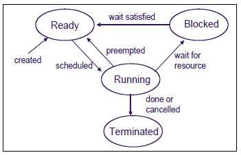
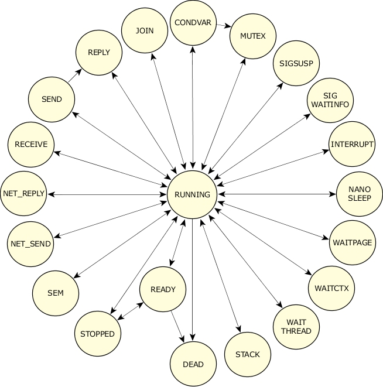

# pthreads

## Multithreading in Linux

The POSIX thread (pthread)libraries are a standards based thread API for C/C++. 

https://man7.org/linux/man-pages/man7/pthreads.7.html

## Thread life cycle 
[Original link](http://www.qnx.com/developers/docs/qnxcar2/index.jsp?topic=%2Fcom.qnx.doc.neutrino.sys_arch%2Ftopic%2Fkernel_Life_Cycle.html)

The number of threads within a process can vary widely, with threads being created and destroyed dynamically.

Thread creation (**pthread_create()**) involves allocating and initializing the necessary resources within the process's address space (e.g., thread stack) and starting the execution of the thread at some function in the address space.

Thread termination (**pthread_exit(), pthread_cancel()**) involves stopping the thread and reclaiming the thread's resources. As a thread executes, its state can generally be described as either "ready" or "blocked." More specifically, it can be one of the following:

## Code 
Most code examples are from Advanced Programming in the UNIX® Environment, Third Edition (by W. Richard Stevens, Stephen A. Rago)

## Platform 
vagrant@vagrant:/vagrant/pthreads$ uname -srvoi
Linux 4.15.0-128-generic #131-Ubuntu SMP Wed Dec 9 06:57:35 UTC 2020 x86_64 GNU/Linux

vagrant@vagrant:/vagrant/pthreads$ gcc --version
gcc (Ubuntu 7.5.0-3ubuntu1~18.04) 7.5.0
Copyright (C) 2017 Free Software Foundation, Inc.

vagrant@vagrant:/vagrant/pthreads$ gcc -g mutex_thread.c  -pthread -ansi -pedantic -Wall
